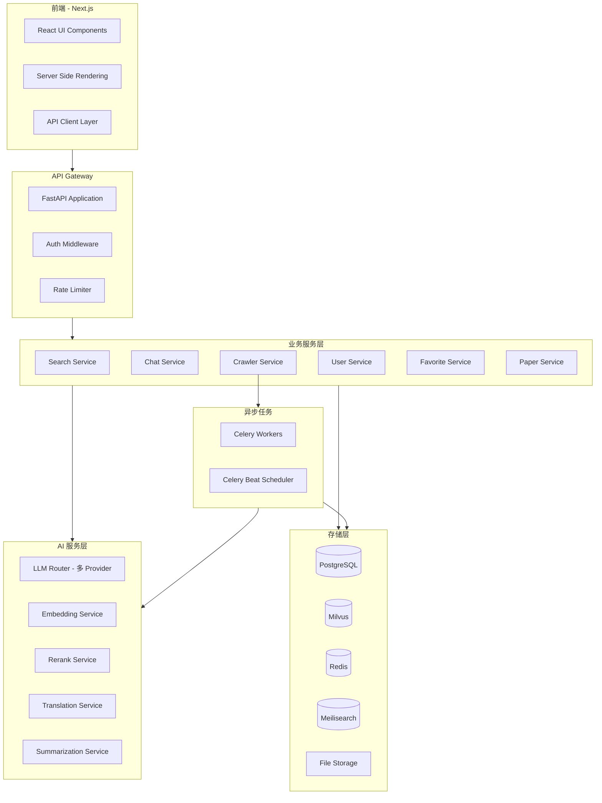
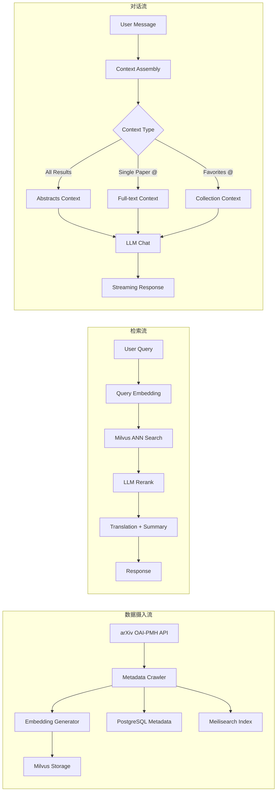
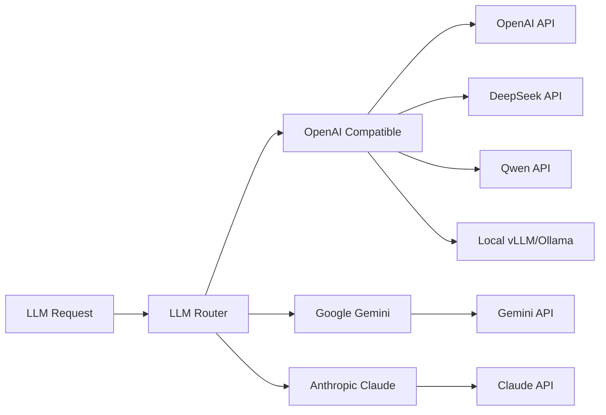
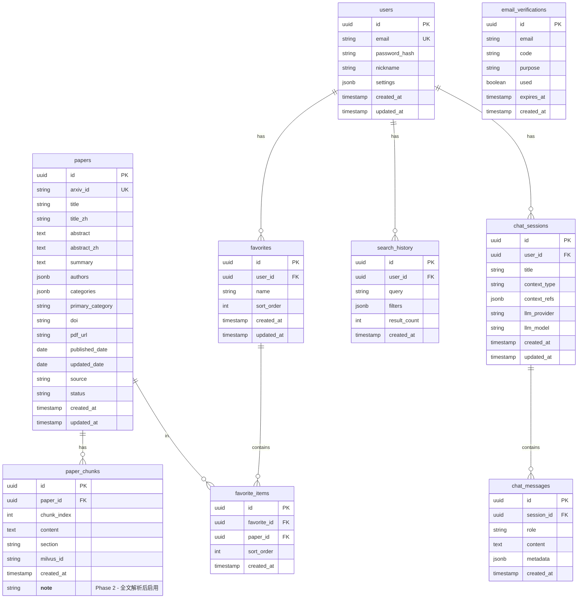

# PaperPanda 系统架构设计文档

## 1. 项目概述

PaperPanda 是一个面向科研用户的论文语义检索系统，提供基于 LLM 的语义搜索、智能摘要、AI 对话、收藏管理等功能。首批数据源为 arXiv，后续可扩展至顶会顶刊。

### 1.1 核心功能

| 功能模块 | 描述 |
|---------|------|
| 语义检索 | 支持任意语言输入，基于向量相似度检索论文 |
| 智能重排 | LLM 对检索结果进行语义重排序 |
| 自动翻译 | 标题、摘要的中文翻译 |
| 智能总结 | 论文摘要的精炼总结 |
| AI 对话 | 基于检索结果/单篇论文/收藏夹的多轮对话 |
| 收藏管理 | 分类收藏夹、拖拽排序、导出 |
| 用户系统 | 邮箱注册登录、搜索历史 |
| 数据爬取 | arXiv 论文元信息与全文的增量爬取 |

### 1.2 技术栈总览

| 层级 | 技术选型 |
|------|---------|
| 前端 | React 18 + Next.js 14 (App Router) + TypeScript + Tailwind CSS + shadcn/ui |
| 后端 | Python 3.11+ + FastAPI + SQLAlchemy + Celery |
| 向量数据库 | Milvus 2.x |
| 关系数据库 | PostgreSQL 16 |
| 缓存 | Redis 7 |
| 消息队列 | Redis (Celery Broker) |
| LLM 服务 | 多 Provider 兼容 - OpenAI / Gemini / Anthropic API |
| Embedding | 本地 BGE / Qwen 或可选 Gemini / OpenAI Embedding API |
| 搜索引擎 | Meilisearch (关键词检索补充) |
| 环境管理 | Conda (env_paper) |
| GPU | 4×NVIDIA RTX 4090 |

---

## 2. 系统架构

### 2.1 整体架构图



### 2.2 数据流架构



---

## 3. 模块详细设计

### 3.1 数据爬取模块 (Crawler Service)

**职责：** 从 arXiv 增量爬取论文元信息与全文

**数据源接口：**
- arXiv OAI-PMH API：获取元数据（标题、作者、摘要、分类、日期）
- arXiv API：按 ID 查询详情

**增量策略：**
- 基于 OAI-PMH 的 `resumptionToken` 实现增量拉取
- 记录上次同步时间戳，每日定时增量更新
- 支持按 arXiv 分类（cs.AI, cs.CL 等）过滤

**数据处理流水线（Phase 1 - 摘要级别）：**
1. 元数据爬取 → PostgreSQL 存储
2. 摘要 Embedding 生成 → 批量向量化
3. 存入 Milvus
4. 标题/摘要索引 → Meilisearch

> **注意：** 全文 PDF 解析（GROBID）作为后续扩展，Phase 1 仅做摘要级别检索。

**Celery 任务设计：**
- `task_crawl_metadata`：增量爬取元数据
- `task_generate_embeddings`：生成向量嵌入
- `task_daily_sync`：每日定时同步（Celery Beat）

### 3.2 检索服务 (Search Service)

**语义检索流程：**
1. 用户输入查询（支持任意语言）
2. Query Embedding：使用 Embedding 模型将查询向量化
3. Milvus ANN 搜索：Top-K 候选（K=100）
4. LLM 重排：对候选结果进行语义重排序，返回 Top-N（N=20）
5. 并行处理：标题翻译 + 摘要总结
6. 返回结构化结果

**检索参数：**
- `query`：查询文本
- `source`：数据源过滤（arxiv / conference / journal）
- `categories`：arXiv 分类过滤
- `date_range`：时间范围
- `page` / `page_size`：分页

**关键词检索补充：**
- Meilisearch 提供传统关键词检索
- 混合检索：语义 + 关键词加权融合

### 3.3 AI 服务层

#### 3.3.1 LLM Router（多 Provider 兼容）



**统一接口设计：**
- 抽象 `LLMProvider` 基类
- 支持 OpenAI 兼容协议（覆盖 DeepSeek、Qwen、本地 vLLM 等）
- 独立适配 Gemini API 和 Anthropic API
- 支持流式输出（SSE）
- 支持 fallback 和负载均衡

#### 3.3.2 Embedding Service

- 本地模型：BGE-M3 / Qwen-Embedding（通过 sentence-transformers 加载）
- 远程 API：OpenAI text-embedding-3-small / Gemini embedding
- 统一接口：`embed(texts: list[str]) -> list[list[float]]`
- 批量处理 + 缓存

#### 3.3.3 功能服务

| 服务 | 输入 | 输出 | LLM 用途 |
|------|------|------|---------|
| Rerank | query + candidates | sorted results | 语义相关性打分 |
| Translate | text + target_lang | translated text | 学术翻译 |
| Summarize | abstract | summary | 精炼总结 |
| Chat | messages + context | response stream | 多轮对话 |

### 3.4 用户系统 (User Service)

**认证方式：**
- 邮箱 + 验证码注册
- JWT Token 认证
- Refresh Token 机制

**用户功能：**
- 注册 / 登录 / 登出
- 搜索历史记录
- 个人设置（默认语言、LLM 偏好等）

### 3.5 收藏管理 (Favorite Service)

**功能：**
- 创建/删除/重命名收藏夹
- 添加/移除论文到收藏夹
- 收藏夹内拖拽排序
- 导出收藏夹（BibTeX / CSV / JSON）
- 收藏夹作为 AI 对话上下文

### 3.6 AI 对话 (Chat Service)

**对话模式：**
1. **全局对话**：以当前检索结果的所有摘要为上下文
2. **单篇 @ 对话**：自动提取该论文全文作为上下文
3. **多篇 @ 对话**：使用选中论文的摘要作为上下文
4. **收藏夹 @ 对话**：以收藏夹内论文摘要为上下文

**# Prompt 预设：**
- 论文详解
- 方法分析
- 实验对比
- 创新点提取
- 相关工作梳理
- 自定义 Prompt

**技术实现：**
- 流式输出（Server-Sent Events）
- 对话历史持久化
- 上下文窗口管理（长文本截断策略）

---

## 4. 数据库设计

### 4.1 PostgreSQL 表结构



### 4.2 Milvus Collection 设计

**Collection: `paper_chunks`**

| 字段 | 类型 | 描述 |
|------|------|------|
| id | VARCHAR(64) | 主键，对应 PG paper_chunks.milvus_id |
| paper_id | VARCHAR(64) | 论文 ID |
| chunk_index | INT64 | 分块索引 |
| embedding | FLOAT_VECTOR(1024) | 向量嵌入（BGE-M3 维度） |
| section | VARCHAR(128) | 所属章节 |

**索引：** IVF_FLAT / HNSW，metric_type = COSINE

**Collection: `paper_abstracts`**

| 字段 | 类型 | 描述 |
|------|------|------|
| id | VARCHAR(64) | 主键，对应 PG papers.id |
| arxiv_id | VARCHAR(32) | arXiv ID |
| embedding | FLOAT_VECTOR(1024) | 摘要向量嵌入 |
| primary_category | VARCHAR(32) | 主分类 |
| published_date | INT64 | 发布日期时间戳 |

**索引：** HNSW，metric_type = COSINE

### 4.3 Redis 用途

| Key Pattern | 用途 | TTL |
|-------------|------|-----|
| `email:verify:{email}` | 邮箱验证码 | 10min |
| `user:token:{user_id}` | Refresh Token | 7d |
| `search:cache:{query_hash}` | 检索结果缓存 | 1h |
| `rate:limit:{ip}` | 接口限流 | 1min |
| `paper:translate:{paper_id}` | 翻译缓存 | 30d |
| `paper:summary:{paper_id}` | 总结缓存 | 30d |

---

## 5. API 设计概览

### 5.1 认证相关

| Method | Path | 描述 |
|--------|------|------|
| POST | `/api/v1/auth/register` | 邮箱注册 |
| POST | `/api/v1/auth/send-code` | 发送验证码 |
| POST | `/api/v1/auth/login` | 登录 |
| POST | `/api/v1/auth/refresh` | 刷新 Token |
| POST | `/api/v1/auth/logout` | 登出 |

### 5.2 检索相关

| Method | Path | 描述 |
|--------|------|------|
| POST | `/api/v1/search` | 语义检索 |
| GET | `/api/v1/search/history` | 搜索历史 |
| GET | `/api/v1/papers/{paper_id}` | 论文详情 |
| GET | `/api/v1/papers/{paper_id}/fulltext` | 论文全文 |

### 5.3 AI 对话

| Method | Path | 描述 |
|--------|------|------|
| POST | `/api/v1/chat/sessions` | 创建对话 |
| GET | `/api/v1/chat/sessions` | 对话列表 |
| POST | `/api/v1/chat/sessions/{id}/messages` | 发送消息（SSE 流式） |
| GET | `/api/v1/chat/sessions/{id}/messages` | 历史消息 |
| DELETE | `/api/v1/chat/sessions/{id}` | 删除对话 |

### 5.4 收藏管理

| Method | Path | 描述 |
|--------|------|------|
| GET | `/api/v1/favorites` | 收藏夹列表 |
| POST | `/api/v1/favorites` | 创建收藏夹 |
| PUT | `/api/v1/favorites/{id}` | 更新收藏夹 |
| DELETE | `/api/v1/favorites/{id}` | 删除收藏夹 |
| POST | `/api/v1/favorites/{id}/papers` | 添加论文 |
| DELETE | `/api/v1/favorites/{id}/papers/{paper_id}` | 移除论文 |
| PUT | `/api/v1/favorites/{id}/sort` | 拖拽排序 |
| GET | `/api/v1/favorites/{id}/export` | 导出收藏夹 |

### 5.5 用户设置

| Method | Path | 描述 |
|--------|------|------|
| GET | `/api/v1/user/profile` | 获取用户信息 |
| PUT | `/api/v1/user/profile` | 更新用户信息 |
| PUT | `/api/v1/user/settings` | 更新设置 |

---

## 6. 项目目录结构

```
PaperPanda2/
├── frontend/                          # Next.js 前端
│   ├── src/
│   │   ├── app/                       # App Router 页面
│   │   │   ├── (auth)/                # 认证相关页面
│   │   │   │   ├── login/
│   │   │   │   └── register/
│   │   │   ├── (main)/                # 主功能页面
│   │   │   │   ├── search/
│   │   │   │   ├── paper/[id]/
│   │   │   │   ├── chat/
│   │   │   │   └── favorites/
│   │   │   ├── layout.tsx
│   │   │   └── page.tsx
│   │   ├── components/                # React 组件
│   │   │   ├── ui/                    # shadcn/ui 基础组件
│   │   │   ├── search/                # 检索相关组件
│   │   │   │   ├── SearchBar.tsx
│   │   │   │   ├── SearchResults.tsx
│   │   │   │   ├── PaperCard.tsx
│   │   │   │   └── FilterPanel.tsx
│   │   │   ├── chat/                  # 对话相关组件
│   │   │   │   ├── ChatPanel.tsx
│   │   │   │   ├── MessageList.tsx
│   │   │   │   ├── MessageInput.tsx
│   │   │   │   └── PromptSelector.tsx
│   │   │   ├── favorites/             # 收藏相关组件
│   │   │   │   ├── FavoritesSidebar.tsx
│   │   │   │   ├── FavoriteList.tsx
│   │   │   │   └── DraggableItem.tsx
│   │   │   └── layout/               # 布局组件
│   │   │       ├── Header.tsx
│   │   │       ├── Sidebar.tsx
│   │   │       └── Footer.tsx
│   │   ├── hooks/                     # 自定义 Hooks
│   │   │   ├── useSearch.ts
│   │   │   ├── useChat.ts
│   │   │   ├── useFavorites.ts
│   │   │   └── useAuth.ts
│   │   ├── lib/                       # 工具库
│   │   │   ├── api.ts                 # API 客户端
│   │   │   ├── auth.ts                # 认证工具
│   │   │   └── utils.ts
│   │   ├── stores/                    # 状态管理 (Zustand)
│   │   │   ├── searchStore.ts
│   │   │   ├── chatStore.ts
│   │   │   ├── authStore.ts
│   │   │   └── favoriteStore.ts
│   │   └── types/                     # TypeScript 类型
│   │       ├── paper.ts
│   │       ├── chat.ts
│   │       ├── user.ts
│   │       └── api.ts
│   ├── public/
│   ├── next.config.ts
│   ├── tailwind.config.ts
│   ├── tsconfig.json
│   └── package.json
│
├── backend/                           # FastAPI 后端
│   ├── app/
│   │   ├── main.py                    # FastAPI 入口
│   │   ├── config.py                  # 配置管理
│   │   ├── dependencies.py            # 依赖注入
│   │   ├── api/                       # API 路由
│   │   │   ├── __init__.py
│   │   │   ├── v1/
│   │   │   │   ├── __init__.py
│   │   │   │   ├── router.py          # 路由聚合
│   │   │   │   ├── auth.py
│   │   │   │   ├── search.py
│   │   │   │   ├── papers.py
│   │   │   │   ├── chat.py
│   │   │   │   ├── favorites.py
│   │   │   │   └── users.py
│   │   │   └── deps.py                # API 依赖
│   │   ├── models/                    # SQLAlchemy 模型
│   │   │   ├── __init__.py
│   │   │   ├── user.py
│   │   │   ├── paper.py
│   │   │   ├── favorite.py
│   │   │   ├── chat.py
│   │   │   └── search_history.py
│   │   ├── schemas/                   # Pydantic Schema
│   │   │   ├── __init__.py
│   │   │   ├── auth.py
│   │   │   ├── paper.py
│   │   │   ├── search.py
│   │   │   ├── chat.py
│   │   │   ├── favorite.py
│   │   │   └── user.py
│   │   ├── services/                  # 业务逻辑层
│   │   │   ├── __init__.py
│   │   │   ├── auth_service.py
│   │   │   ├── search_service.py
│   │   │   ├── paper_service.py
│   │   │   ├── chat_service.py
│   │   │   ├── favorite_service.py
│   │   │   └── user_service.py
│   │   ├── ai/                        # AI 服务层
│   │   │   ├── __init__.py
│   │   │   ├── llm/
│   │   │   │   ├── __init__.py
│   │   │   │   ├── base.py            # LLM Provider 基类
│   │   │   │   ├── openai_provider.py # OpenAI 兼容
│   │   │   │   ├── gemini_provider.py
│   │   │   │   ├── anthropic_provider.py
│   │   │   │   └── router.py          # Provider 路由
│   │   │   ├── embedding/
│   │   │   │   ├── __init__.py
│   │   │   │   ├── base.py
│   │   │   │   ├── local_embedding.py  # BGE/Qwen 本地
│   │   │   │   ├── openai_embedding.py
│   │   │   │   └── gemini_embedding.py
│   │   │   ├── reranker.py
│   │   │   ├── translator.py
│   │   │   └── summarizer.py
│   │   ├── crawler/                   # 爬虫模块
│   │   │   ├── __init__.py
│   │   │   ├── arxiv_crawler.py       # arXiv 爬虫
│   │   │   └── pipeline.py            # 数据处理流水线
│   │   ├── tasks/                     # Celery 异步任务
│   │   │   ├── __init__.py
│   │   │   ├── celery_app.py
│   │   │   ├── crawl_tasks.py
│   │   │   ├── embedding_tasks.py
│   │   │   └── scheduled_tasks.py
│   │   ├── db/                        # 数据库
│   │   │   ├── __init__.py
│   │   │   ├── session.py             # DB Session
│   │   │   ├── milvus.py              # Milvus 客户端
│   │   │   ├── redis.py               # Redis 客户端
│   │   │   └── migrations/            # Alembic 迁移
│   │   │       ├── env.py
│   │   │       └── versions/
│   │   ├── core/                      # 核心工具
│   │   │   ├── __init__.py
│   │   │   ├── security.py            # JWT / 密码
│   │   │   ├── email.py               # 邮件发送
│   │   │   ├── exceptions.py          # 自定义异常
│   │   │   └── logging.py             # 日志配置
│   │   └── utils/                     # 通用工具
│   │       ├── __init__.py
│   │       └── helpers.py
│   ├── tests/                         # 测试
│   │   ├── conftest.py
│   │   ├── test_api/
│   │   ├── test_services/
│   │   └── test_ai/
│   ├── alembic.ini
│   ├── pyproject.toml
│   ├── requirements.txt
│   └── .env.example
│
├── plans/                             # 设计文档
│   └── 01-system-architecture.md
├── scripts/                           # 运维脚本
│   ├── init_milvus.py                 # 初始化 Milvus Collection
│   ├── init_db.py                     # 初始化数据库
│   └── seed_data.py                   # 种子数据
├── docker-compose.yml                 # 基础设施（PG/Redis/Milvus/Meilisearch）
├── environment.yml                    # Conda 环境配置
├── .env.example
├── .gitignore
└── README.md
```

---

## 7. 关键技术决策

### 7.1 Embedding 模型选择

| 模型 | 维度 | 多语言 | 部署方式 | 推荐场景 |
|------|------|--------|---------|---------|
| BGE-M3 | 1024 | 是 | 本地 GPU | 默认推荐，效果好 |
| Qwen-Embedding | 1536 | 是 | 本地 GPU | 中文场景优化 |
| text-embedding-3-small | 1536 | 是 | OpenAI API | 无 GPU 环境 |
| Gemini Embedding | 768 | 是 | Google API | 备选 |

**推荐：** 默认使用 BGE-M3（本地部署），支持配置切换到 API 模式。

### 7.2 LLM 调用策略

- 翻译/总结：使用轻量模型（如 DeepSeek-V3 / Qwen-Plus），成本低速度快
- 重排：使用中等模型，需要较好的理解能力
- 对话：用户可选模型，默认使用较强模型
- 所有 LLM 调用支持流式输出

### 7.3 检索策略

1. **第一阶段 - 向量召回**：Milvus ANN 搜索，Top-100
2. **第二阶段 - 重排**：LLM/Cross-Encoder 重排，Top-20
3. **可选 - 混合检索**：Meilisearch 关键词 + 向量融合（RRF 算法）

### 7.4 文本分块策略（Phase 2 - 全文解析后启用）

- 基于章节的语义分块
- 滑动窗口：chunk_size=512 tokens, overlap=64 tokens
- 保留章节标题作为 metadata
- 摘要单独存储为独立向量

> **Phase 1 说明：** 初期仅对论文摘要进行 Embedding，不涉及全文分块。

---

## 8. 非功能性需求

### 8.1 性能目标

| 指标 | 目标 |
|------|------|
| 检索响应时间 | < 3s（含重排） |
| 翻译/总结延迟 | < 2s |
| 对话首 Token 延迟 | < 1s |
| 并发用户数 | 100+ |

### 8.2 安全性

- JWT Token + Refresh Token 双 Token 机制
- 接口限流（IP + 用户维度）
- 密码 bcrypt 加密
- 邮箱验证码防刷（60s 间隔）
- CORS 配置
- SQL 注入防护（SQLAlchemy ORM）

### 8.3 可观测性

- 结构化日志（JSON 格式）
- API 请求追踪
- LLM 调用监控（耗时、Token 用量、成本）
- Celery 任务监控

---

## 9. 开发阶段规划

### Phase 1：基础框架搭建
- 前后端项目初始化
- 数据库 Schema 与迁移
- 用户认证系统
- 基础 API 框架

### Phase 2：数据管道
- arXiv 爬虫实现
- PDF 解析与分块
- Embedding 生成与存储
- Milvus Collection 初始化

### Phase 3：核心检索
- 语义检索实现
- LLM 重排
- 翻译与总结
- 检索结果页面

### Phase 4：AI 对话
- 多 Provider LLM 路由
- 对话上下文管理
- @ 和 # 功能
- 流式输出

### Phase 5：产品功能
- 收藏夹管理
- 搜索历史
- 导出功能
- UI 优化

### Phase 6：运维与优化
- Docker Compose 部署
- 性能优化
- 监控告警
- 文档完善
